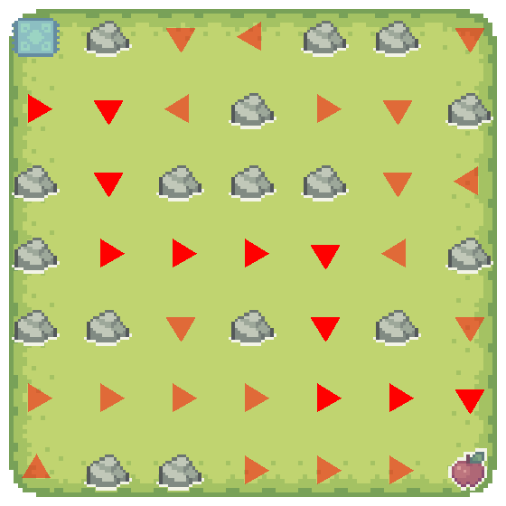
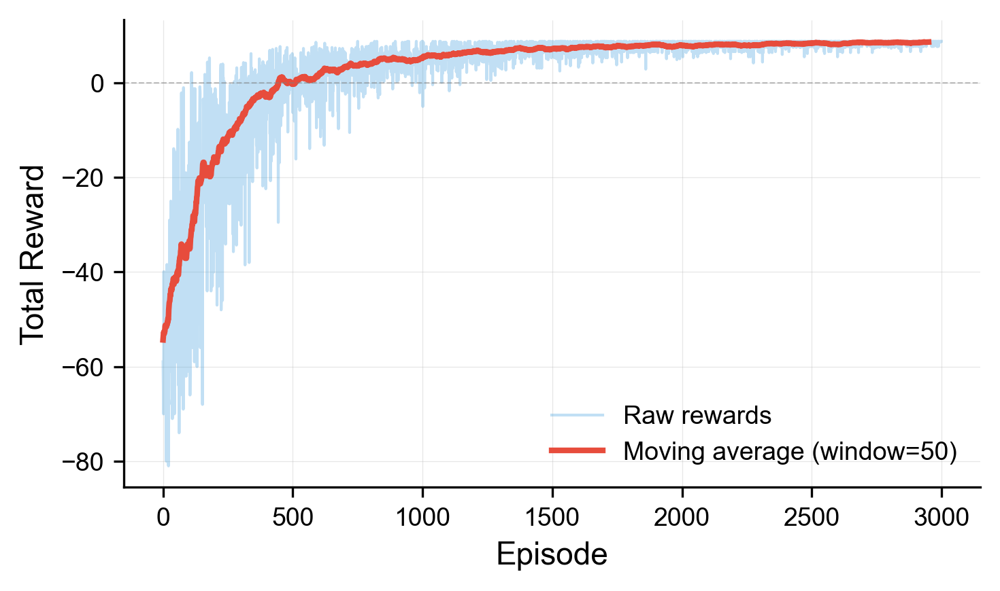
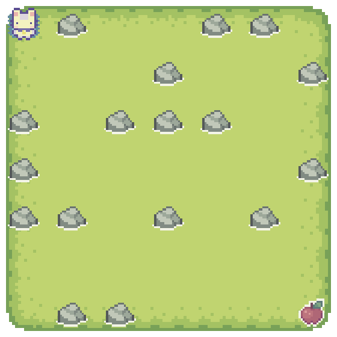
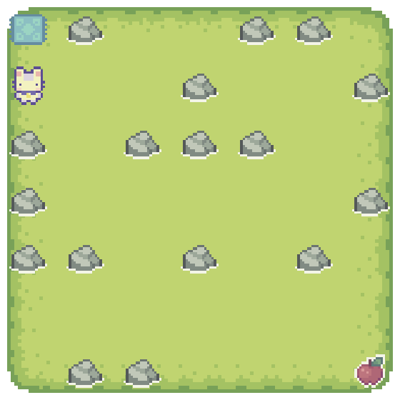
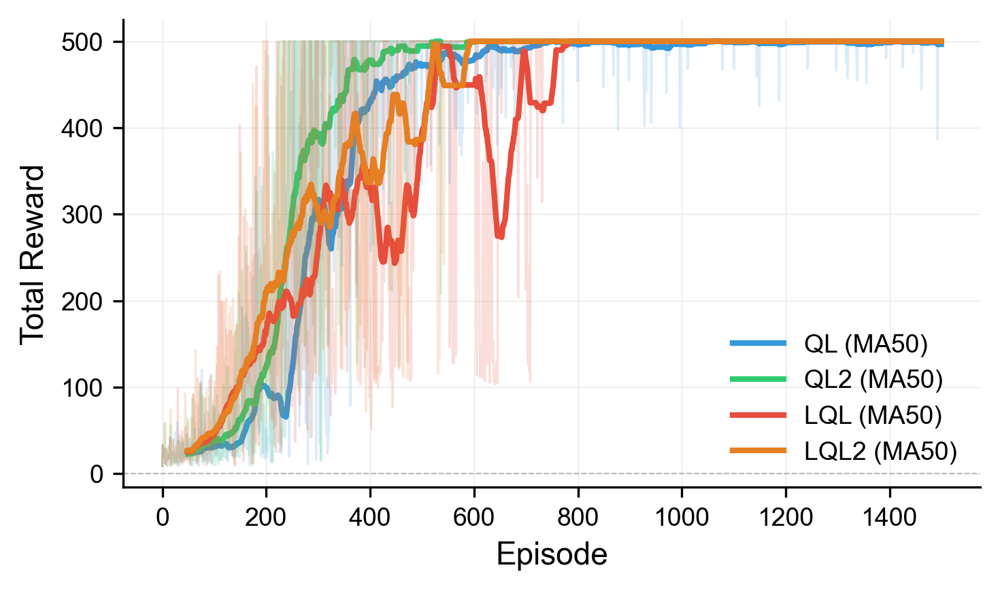
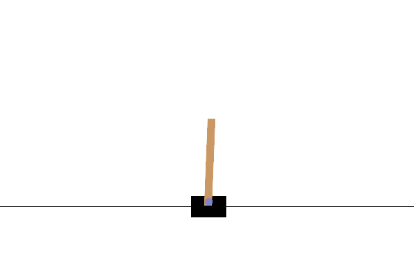

# Logical-Q-Learning

This repository includes two experiment groups:
- `GridWorld` (`run_viz_ql_gridworld.py` / `run_viz_lql_gridworld.py`)
- `CartPole` (`run_ql_cartpole.py` / `run_lql_cartpole.py` / `run_ql_cartpole2.py` / `run_lql_cartpole2.py`)

Training and visualization outputs are saved to `recordings/` by default.

## 1. Environment Setup

Python version: the experiment was conducted using Python version **3.14.2**, but other versions may also work.

```bash
python -m venv .venv
source .venv/bin/activate
pip install -r requirements.txt
```

## 2. Scripts to Run

### 2.1 GridWorld (with episode recordings)

```bash
# QL version: generates GIFs, trajectory image, reward curve, etc.
python run_viz_ql_gridworld.py

# LQL version: generates GIFs, trajectory image, reward curve, etc.
python run_viz_lql_gridworld.py
```

Output directories:
- `recordings/gridworld_ql/`
- `recordings/gridworld_lql/`

Main artifacts:
- `episode_0000.gif` ~ `episode_2999.gif` (recorded every 500 episodes)
- `final.png` (final policy visualization)
- `trajectory.png` (final path visualization)
- `rewards.pkl` / `rewards.png`

### 2.2 CartPole (training + demo GIF)

```bash
# QL / LQL (base reward versions)
python run_ql_cartpole.py
python run_lql_cartpole.py

# QL2 / LQL2 (reward-shaping versions)
python run_ql_cartpole2.py
python run_lql_cartpole2.py
```

Each script generates:
- `rewards_raw.pkl`
- `cartpole_*_demo.gif`

Output directories:
- `recordings/cartpole_ql/`
- `recordings/cartpole_lql/`
- `recordings/cartpole_ql2/`
- `recordings/cartpole_lql2/`

### 2.3 Plot CartPole reward curves and comparison

```bash
python visualize_cartpole_ql_rewards.py
python visualize_cartpole_lql_rewards.py
python visualize_cartpole_ql2_rewards.py
python visualize_cartpole_lql2_rewards.py

# Combined comparison of all 4 methods
python visualize_cartpole_reward_comparison.py
```

Outputs:
- `rewards_raw.png` under each CartPole recording directory
- `recordings/cartpole_compare/rewards_compare.png`

## 3. Results in `recordings/`

> The following results are from the existing files in this repository.

### 3.1 CartPole reward summary (from `rewards_raw.pkl`)

| Method | Episodes | Last-100 Avg Reward | Best Reward |
| ------ | -------: | ------------------: | ----------: |
| QL     |     1500 |              497.88 |      500.00 |
| QL2    |     1500 |              500.00 |      500.00 |
| LQL    |     1500 |              500.00 |      500.00 |
| LQL2   |     1500 |              500.00 |      500.00 |

### 3.2 GridWorld reward summary (from `rewards.pkl`)

| Method | Episodes | First-100 Avg Reward | Last-100 Avg Reward | Best Reward |
| ------ | -------: | -------------------: | ------------------: | ----------: |
| LQL    |     3000 |              -47.784 |               8.561 |       8.800 |

### 3.3 Visualization examples

GridWorld (LQL):

**Final Policy**

<p align="center">
  
</p>

**Training Reward Curve**

<p align="center">
  
</p>

GridWorld (LQL) key training stages:

<table width="100%">
  <tr>
    <td align="center"><b>Start (Episode 0)</b></td>
    <td align="center"><b>Middle (Episode 500)</b></td>
    <td align="center"><b>End (Episode 2999)</b></td>
  </tr>
  <tr>
    <td></td>
    <td></td>
    <td></td>
  </tr>
</table>

CartPole comparison across all four methods:

<p align="center">
  
</p>

CartPole demo examples:

<table width="100%" border="0">
  <tr>
    <td align="center"><b>QL Demo</b></td>
    <td align="center"><b>LQL Demo</b></td>
  </tr>
  <tr>
    <td></td>
    <td></td>
  </tr>
</table>

## 4. Quick Reproduction (recommended order)

```bash
# 1) Run the four CartPole trainings
python run_ql_cartpole.py
python run_lql_cartpole.py
python run_ql_cartpole2.py
python run_lql_cartpole2.py

# 2) Generate all CartPole plots
python visualize_cartpole_ql_rewards.py
python visualize_cartpole_lql_rewards.py
python visualize_cartpole_ql2_rewards.py
python visualize_cartpole_lql2_rewards.py
python visualize_cartpole_reward_comparison.py

# 3) Run GridWorld visualization training
python run_viz_ql_gridworld.py
python run_viz_lql_gridworld.py
```
